[homoPages](https://github.com/DevDragonLi)

# Core Animation框架结构及性能调优 均为图片

## 1.Core Animation

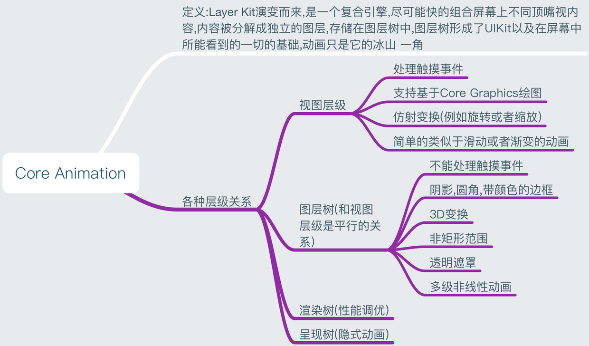
## 2.CALayer
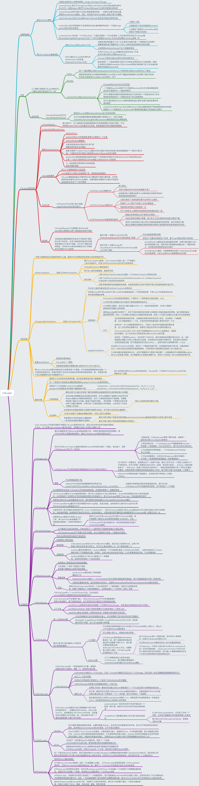

## 3.隐式动画
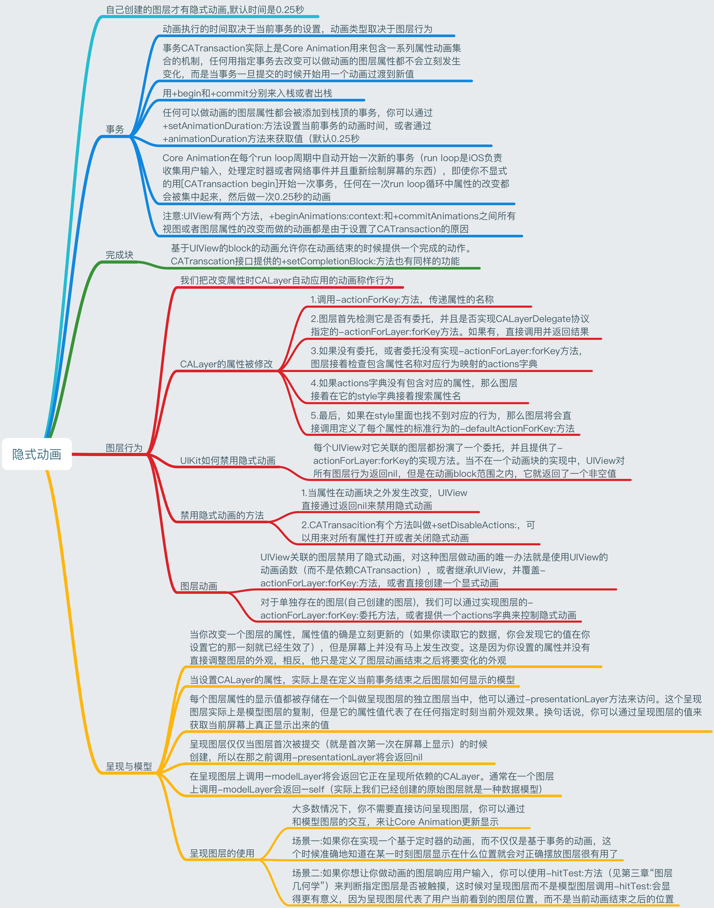

## 4.显式动画
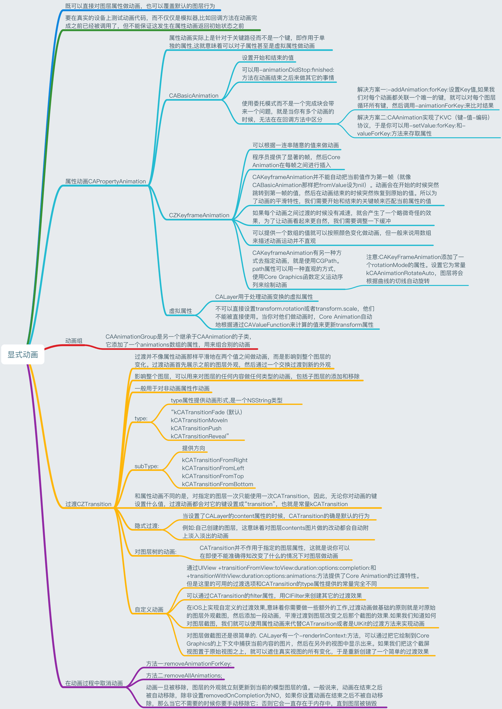

## 5.图层时间
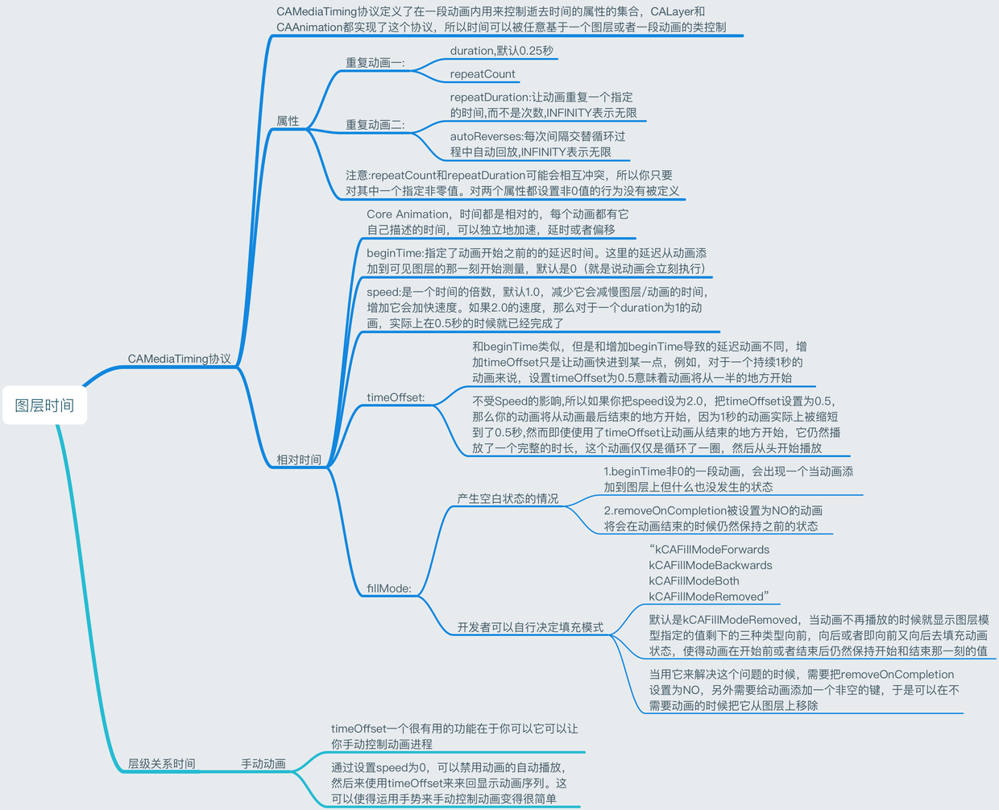

## 6.缓冲
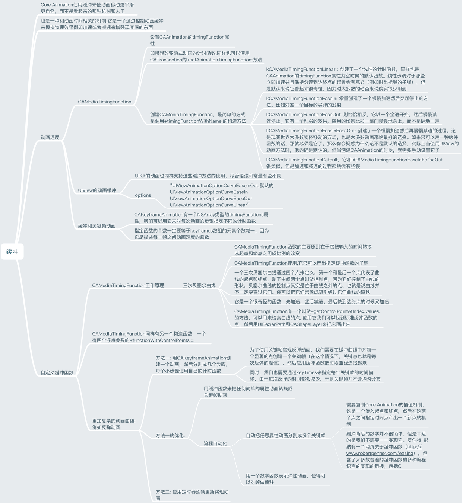

## 7.基于定时器的动画
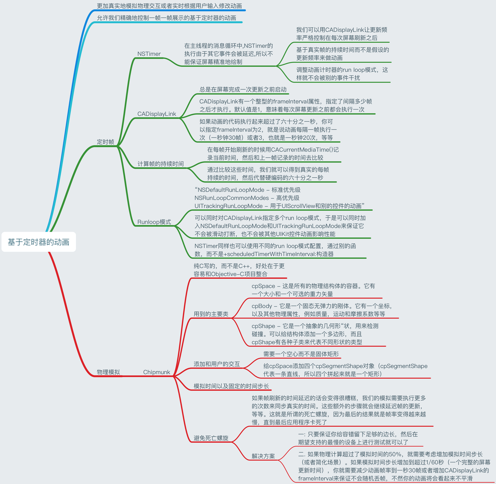

## 8.性能调优
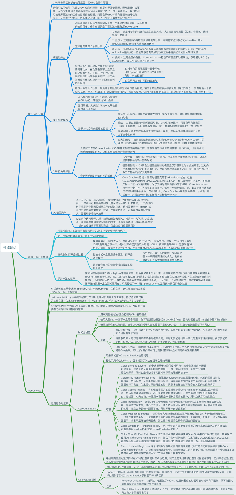

## 9.高效绘图
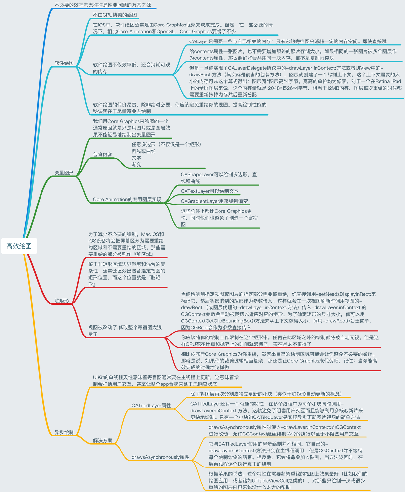

## 10.图像IO
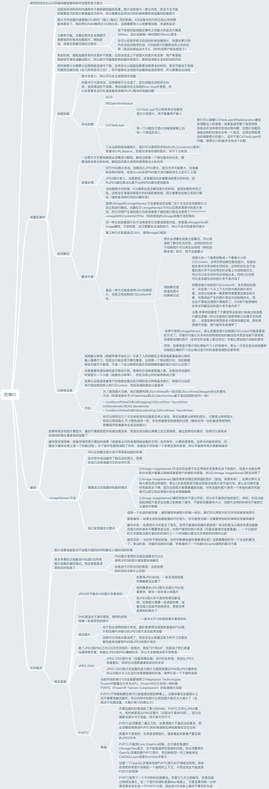

## 11.图层性能
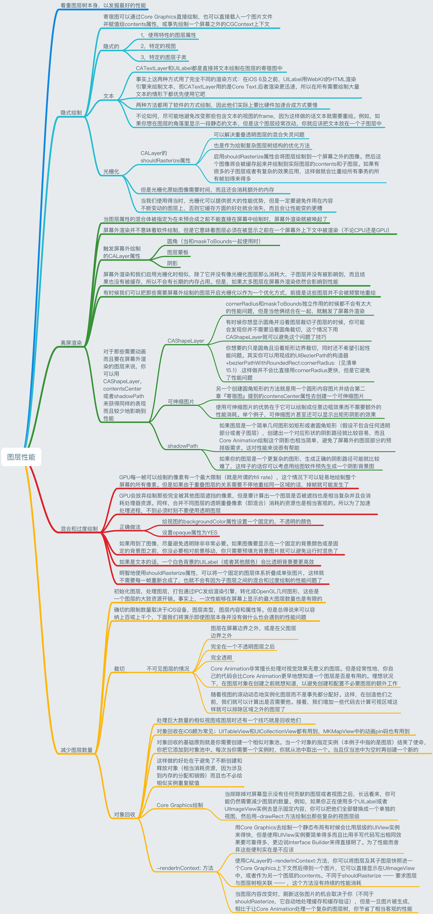

			

